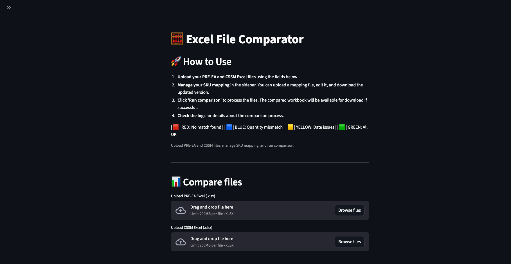

# Portfolio Specialist Automation 🚀

---

## ⚙️ Setup
You can use either `uv` (fast, recommended) or standard `pip` to set up your environment.

### 🏎️ Using uv (recommended)
```zsh
uv venv
source .venv/bin/activate  # macOS/Linux
uv pip install -r requirements.txt
```

### 🐍 Using pip
```zsh
python3 -m venv .venv
source .venv/bin/activate  # macOS/Linux
pip install -r requirements.txt
```

---


## 🖥️ Running the Excel Comparator App (macOS)
After setup, launch the web application:

```zsh
streamlit run streamlit_excel_comparator.py
```

This will open the app in your default browser. You can upload Excel files, handle SKU exceptions, and view comparison results interactively.

<!-- Screenshot: Main interface after launching the app -->


---
```zsh
streamlit run streamlit_excel_comparator.py
```

---

## 🧠 How the Comparison Logic Works

The application compares two Excel files: a PRE-EA workbook and a CSSM export. The logic follows these main steps:

1. **Data Extraction:**
  - Reads relevant columns from both files (e.g., order number, SKU, quantity, expiration date).
  - Handles header rows and sheet selection automatically.

2. **SKU Matching:**
  - Directly matches SKUs between PRE-EA and CSSM.
  - Uses the SKU Exceptions Handler to map alternate or exception SKUs when a direct match is not found.

3. **Row-by-Row Comparison:**
  - For each PRE-EA row, checks if the order number and SKU exist in CSSM.
  - Compares quantities and expiration dates, applying color codes for mismatches:
    - **RED:** Order number or SKU not found
    - **BLUE:** Quantity mismatch
    - **YELLOW:** Date missing/invalid, or PRE-EA expiration after CSSM expiration
    - **GREEN:** All checks pass

4. **Result Output:**
  - Produces a color-coded Excel workbook highlighting mismatches and issues.
  - Generates a detailed log file for review.
  - Allows downloading the compared workbook and logs from the web interface.

This logic ensures that discrepancies between the two sources are clearly identified, and exceptions are handled flexibly via the mapping tool.

---
- 📁 Upload and compare two Excel files (`cssm.xlsx`, `pre-ea.xlsx`)
  <!-- Screenshot: File upload and comparison -->
  
- ⬇️ Download the comparison results as an Excel file
  <!-- Screenshot: Download button -->
  
- 📊 View row-by-row comparison results and logs
  <!-- Screenshot: Comparison results table -->
  
- 🛠️ Handle SKU exceptions and mapping via sidebar
- 💾 Save and download updated SKU mapping
  <!-- Screenshot: SKU Exceptions Handler sidebar -->
  

---

## 📝 Notes
- All `.xlsx` files and cache are ignored by git (see `.gitignore`).
- The app works cross-platform.
- For a clean environment, always activate your virtual environment before running the app.

## � Python Modules Used

The main Python modules and packages used in this project are:

- `streamlit` — for the interactive web interface
- `pandas` — for data manipulation and analysis
- `openpyxl` — for reading and writing Excel files
- `json` — for handling SKU mapping and configuration
---
#
---

## 📝 TODO

- Review and improve logic for cases where there are multiple items (SKUs or order numbers) that need quantity verification. Ensure the comparison correctly sums and matches quantities across all relevant rows in both PRE-EA and CSSM files.

---

Saludos Cordiales 🤗